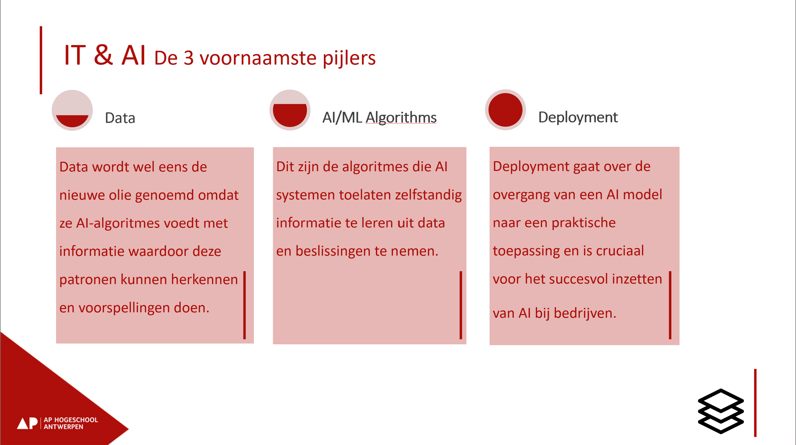

# Welkom

Welkom bij het opleidingsonderdeel Mathematical Foundations van het IT & AI traject! Deze cursus ondersteunt je bij het leren van de wiskundige basis voor AI en machine learning.

## Kadering binnen IT & AI traject

Het IT & AI traject is opgebouwd rond drie fundamentele pijlers:



Mathematical Foundations vormt de onmisbare basis die deze drie pijlers met elkaar verbindt:

**Data**: Om data effectief te kunnen verwerken en representeren, heb je kennis nodig van lineaire algebra (vectoren en matrices) en statistiek. Deze cursus leert je hoe je data wiskundig kunt weergeven en analyseren.

**AI/ML Algorithms**: De algoritmes die AI-systemen laten leren, zijn fundamenteel wiskundig van aard. Concepten zoals gradient descent, kostenfuncties, en kansverdelingen vormen de kern van machine learning. Zonder begrip van afgeleiden, optimalisatie en waarschijnlijkheidstheorie blijven deze algoritmes een "black box".

**Deployment**: Hoewel deployment vooral praktisch gericht is, helpt wiskundige kennis bij het begrijpen van modelprestaties, het kwantificeren van onzekerheid in voorspellingen, en het maken van onderbouwde keuzes bij de implementatie van AI-oplossingen.

Kortom: Mathematical Foundations geeft je de gereedschappen om AI niet alleen te gebruiken, maar ook te begrijpen en verbeteren.

## Leerdoelen

Na het volgen van deze cursus kan je:

**Onderzoeken:**
1) Beoordeelt de prestaties van machine learning modellen met behulp van intervalschattingen en foutmarges.

**Ontwerpen:**

2) Voert het gradient descent algoritme uit voor neurale netwerken met verschillende activerings- en kostenfuncties.
3) Bespreekt de eigenschappen van veelgebruikte kansverdelingen in machine learning.
4) Past vector- en matrixalgebrabewerkingen toe, zoals scalair product, inverse en determinant.
5) Past statistische methoden zoals maximum likelihood estimation (MLE) en maximum a priori (MAP) toe binnen de context van machine learning.
6) Beschrijft en kwantificeert de onzekerheid die inherent is aan voorspellingen van modellen voor machine learning.

**Realiseren**

7) Geeft data weer als vectoren en matrices en identificeert hun eigenschappen met behulp van concepten als singulariteit en lineaire onafhankelijkheid.
8) Optimaliseert functies die vaak gebruikt worden bij machine learning analytisch en numeriek met behulp van eigenschappen van afgeleiden.

## Inhoud

De cursus bevat de volgende onderdelen:

1. **Introductie** - Cursusoverzicht en Python/NumPy basis
2. **Lineaire Algebra** - Vectoren, matrices, determinant, inverse en PCA
3. **Analyse** - Functies, afgeleiden, optimalisatie en neurale netwerken
4. **Waarschijnlijkheid en Statistiek** - Kansrekening, verdelingen, MLE/MAP en onzekerheid

## Werken met de cursus

Deze cursus bestaat uit interactieve Jupyter Notebooks met Python codeblokken. Je kunt de theorie lezen én direct zelf experimenteren met de code.

**Er zijn twee manieren om met de notebooks te werken:**

1. **Lokaal** - Download de notebooks en draai ze op je eigen computer met VS Code, JupyterLab of een andere editor. Hiervoor moet je Python en de benodigde packages installeren.

2. **Google Colab** - Open de notebooks direct in de cloud via [Google Colab](https://colab.research.google.com/). Dit vereist geen installatie, enkel een Google account.

## Aan de slag

Gebruik het menu aan de linkerkant om door de cursus te navigeren.

```{tableofcontents}
```
